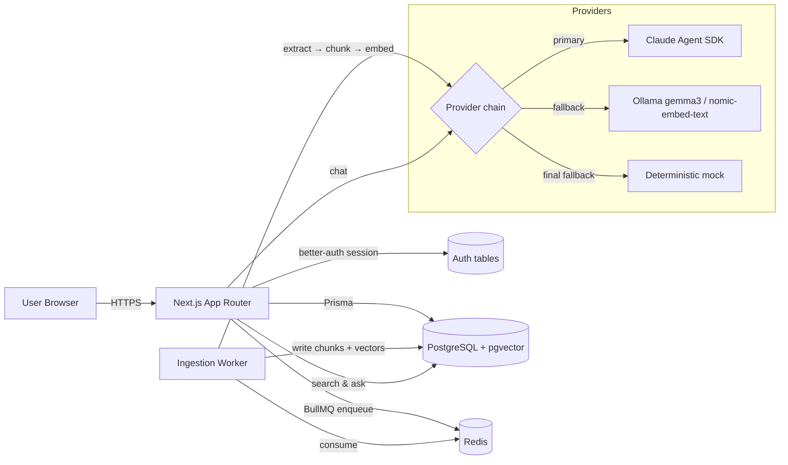

# SourceLens

> Production-style enterprise document search & RAG platform — multi-tenant
> workspaces, hybrid keyword + vector retrieval, source-cited answers, and a
> BullMQ-backed ingestion pipeline.

This project demonstrates senior full-stack and AI-engineering work end to end:
authenticated workspaces, document ingestion with background workers, pgvector
similarity search fused with full-text keyword search, retrieval-augmented
answers with citations, and an operational dashboard.

---

## Table of contents

- [Architecture](#architecture)
- [Tech stack](#tech-stack)
- [Quick start](#quick-start)
- [Environment variables](#environment-variables)
- [Ingestion pipeline](#ingestion-pipeline)
- [Search architecture](#search-architecture)
- [RAG flow](#rag-flow)
- [Provider chain](#provider-chain)
- [Security & tenant isolation](#security--tenant-isolation)
- [Testing](#testing)
- [Known limitations](#known-limitations)
- [Future improvements](#future-improvements)

---

## Architecture



Two long-running processes: the Next.js app (HTTP) and a separate BullMQ worker
(`pnpm worker`). They share the Postgres database and Redis queue.

---

## Tech stack

| Layer        | Choice                                                     |
|--------------|------------------------------------------------------------|
| Framework    | Next.js 16 (App Router) · React 19 · TypeScript            |
| Styling      | Tailwind CSS v4 (hand-rolled UI primitives)                |
| Database     | PostgreSQL 16 + `pgvector` (Prisma ORM, `vector(768)`)     |
| Queue        | Redis 7 + BullMQ (ingestion worker, retries, retention)    |
| Auth         | [better-auth](https://better-auth.com) (email + password)  |
| LLM          | Claude Agent SDK → Ollama `gemma3:4b` → mock (fallback)    |
| Embeddings   | Ollama `nomic-embed-text` (768-dim) → deterministic mock   |
| File parsing | `pdf-parse`, `mammoth` (DOCX), native UTF-8 (TXT/MD)       |
| Validation   | Zod                                                        |

---

## Quick start

### 1. Start infra

```bash
cp .env.example .env
docker compose up -d postgres redis
# optional: local LLM/embeddings
docker compose --profile ollama up -d ollama
docker exec -it $(docker ps -qf name=ollama) ollama pull nomic-embed-text
docker exec -it $(docker ps -qf name=ollama) ollama pull gemma3:4b
```

### 2. Install + migrate

```bash
pnpm install
pnpm db:setup       # db push + pgvector + index + seed demo data
```

`db:setup` runs:

1. `prisma db push` — creates tables and enables the `vector` extension.
2. `prisma/post-deploy.sql` — adds the HNSW index on `Chunk.embedding` and a GIN
   index on the tsvector expression of `Chunk.text`.
3. `prisma/seed.ts` — creates a demo user, workspace and three pre-indexed sample
   documents.

### 3. Run the app + worker

```bash
# terminal 1
pnpm dev

# terminal 2
pnpm worker
```

Open <http://localhost:3000>.

**Demo login:** `demo@sourcelens.dev` / `sourcelens-demo`

---

## Environment variables

See `.env.example` for the full list. Notable:

| Var                  | Purpose                                                  |
|----------------------|----------------------------------------------------------|
| `DATABASE_URL`       | Postgres connection (must have `pgvector` available).    |
| `REDIS_URL`          | Redis for BullMQ.                                        |
| `BETTER_AUTH_SECRET` | Server secret for cookie/session signing.                |
| `ANTHROPIC_API_KEY`  | Optional. Enables Claude Agent SDK chat.                 |
| `OLLAMA_HOST`        | Defaults to `http://localhost:11434`.                    |
| `EMBEDDING_DIM`      | Must match the `vector(N)` column in `schema.prisma`.    |
| `MAX_UPLOAD_BYTES`   | Per-file upload size limit.                              |

---

## Ingestion pipeline

```
upload → POST /api/documents
       → saveUpload (local FS, swappable for S3/R2/Blob)
       → Document row {status: uploaded}
       → enqueueIngest(documentId)
worker  ← BullMQ "ingest" queue
        → extractText (pdf-parse / mammoth / utf-8)
        → chunkText  (~2000 chars, paragraph-aware, 200-char overlap)
        → embedTexts (Ollama nomic-embed-text → mock)
        → INSERT chunks + vectors (single transaction, raw SQL for pgvector)
        → Document {status: indexed, ingestDurationMs}
        → IngestJob {state: completed}
```

Failures: BullMQ retries 3× with exponential backoff. Final failure flips
`Document.status = failed` and writes the error message. The Documents and Jobs
pages surface a one-click **Retry** action.

---

## Search architecture

Three modes on `POST /api/search`:

- **keyword** — Postgres `to_tsvector('english', text) @@ websearch_to_tsquery`
  ranked by `ts_rank`. Uses the `chunk_text_fts` GIN index.
- **vector** — pgvector cosine distance (`embedding <=> query_vector`), HNSW
  index for ANN.
- **hybrid** (default) — top-25 of each, fused with reciprocal rank fusion
  (k = 60).

All queries are scoped by `workspaceId` in the WHERE clause — there is no path
by which a chunk from another workspace can appear in a result.

---

## RAG flow

`POST /api/ask` (`Ask` page) does:

1. Hybrid search top-6 chunks for the question.
2. Compose a system prompt + numbered context block.
3. Call the chat provider chain.
4. Persist the (`question`, `answer`, citations, model, provider,
   retrievalScore) row in `Question`.
5. Return the answer plus citations and full context text for the UI.

Citations render directly under the answer with score + filename + chunk
number, so any sentence can be verified against its source.

---

## Provider chain

Both embeddings and chat use ordered fallback chains. The first provider that
succeeds wins; on failure or unavailability the next provider is tried.

**Embeddings:**

1. Ollama `nomic-embed-text` (768 dim) — used when `/api/tags` responds.
2. Deterministic SHA-256-derived mock vector — always available.

**Chat:**

1. **Claude Agent SDK** (`@anthropic-ai/claude-agent-sdk`) when
   `ANTHROPIC_API_KEY` is set.
2. **Ollama `gemma3:4b`** local model when reachable.
3. **Mock** — returns the top retrieved chunks as a labelled `[DEMO MODE]`
   answer, so the UI always renders something usable.

The chain means the project runs end-to-end with **no paid API keys** and
without an internet connection (set up Ollama with `gemma3` and
`nomic-embed-text` for real models, or accept the deterministic mock for tests).

---

## Security & tenant isolation

- Every API route resolves the caller's user via better-auth and the **current
  workspace** via `requireCurrentWorkspace()`. There is no path to query another
  workspace's data.
- All SQL — including the raw vector and full-text queries — joins on
  `workspaceId` so an attacker manipulating a chunk id cannot fetch foreign
  data.
- Uploaded files are size-checked (`MAX_UPLOAD_BYTES`) and type-checked against
  an allowlist of MIMEs / extensions.
- Storage paths are workspace-prefixed and stem-sanitised before being written.
- Secrets never reach the client: only `BETTER_AUTH_URL` and public Next.js
  values are exposed.

---

## Testing

The provider abstraction, chunker and search query validation are pure
functions — they're written to be unit-testable without I/O. A future commit
should add:

- `chunkText` covering long-paragraph, very-short and overlap cases.
- `embedTexts` mock vs Ollama-stub round-trip.
- `searchSchema.parse` invalid inputs.
- `requireCurrentWorkspace()` against a Prisma test database.
- A Playwright smoke that logs in as the demo user, uploads `welcome.txt`, sees
  it appear in the list, and asks a question.

The seed-included sample documents make this slice demonstrable in under a
minute without any external services.

---

## Known limitations

- **Single-workspace UX.** Each user gets one workspace (auto-created on
  signup). Workspace switching, invitations and the four-role model in the
  schema are wired in the DB but not yet exposed in the UI.
- **DOCX path** depends on `mammoth`; complex Word features (tables, images)
  are dropped to plain text.
- **Local storage only** for now. The `saveUpload` / `readUpload` interface in
  `src/lib/storage/local.ts` is the seam where an S3/R2/Blob adapter would slot
  in.
- **No streaming** for chat responses; the Ask page waits for the full LLM
  reply.

## Future improvements

- Workspace switcher and invitations UI.
- Streaming RAG answers (SSE) and inline citation highlighting on hover.
- Re-ranker pass over the fused top-N before sending to the LLM.
- Per-document delete from search index without re-running the worker.
- Bull Board mount at `/internal/bull` for queue ops.
- OpenTelemetry traces across upload → ingest → search.
